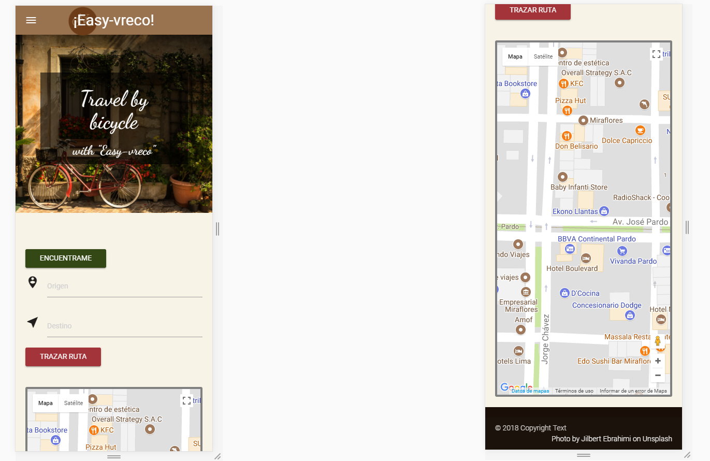

# Easy Vreco

* **Track:** _Js Front End Developer_
* **Curso:** _Construye una single page app multiusuario consumiendo data remota_
* **Unidad:** _¿Qué hay de nuevo en HTML5?_

***

### Reto:
Crear una geolocalización con el API de Google Maps.

* Mobile and desktop.
* Google Maps Api

#### Solución:

Easy-vreco, es una pagína web que te permite al usuario ubicarse y descubrir lugares. Decide a dónde ir con ayuda de la ruta en bicicleta.

